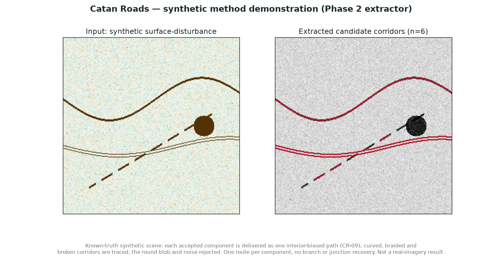

# Informal Road Mapping

Screen persistent surface disturbance for candidate informal-road corridors in
Mongolia, then test those candidates against dated reference imagery.

[](https://github.com/500ft/informal-road-mapping/actions/workflows/ci.yml)

[](LICENSE)

[Overview](#overview) · [Evidence](#evidence) · [Getting started](#getting-started) · [Documentation](#documentation) · [Next milestone](#next-milestone)


*Method overview, not a satellite result. Real-site evaluation and network
conditioning remain gated. [Visual provenance](docs/REPOSITORY_IDENTITY.md#visual-provenance).*

## Overview

A change map is not a road detector: vegetation, agriculture, riverbeds and
weather can all produce strong signals. This project targets **corridor-scale
positive surface disturbance**, not individual sub-pixel tire tracks or inferred
traffic volume.

The research path combines same-season Sentinel-2 composites with a quantitative
negative control, then evaluates line-like candidates. OpenStreetMap conditioning
is a planned ranking/ablation step—not a requirement that every road touch an
existing mapped node.

| Component | Purpose | Present state |
| --- | --- | --- |
| Earth Engine screening | Fuse vegetation-loss and exposed-surface signals, local controls and persistence | Code and static checks; real-site gate unrun |
| Python extraction | Identify elongated components in disturbance rasters | Tested on known-truth synthetic scenes |
| Admission checks | Require consistent exports, site provenance and control comparisons | Tested command-line gate |
| Reference inspection | Establish what the registered sites actually contain | Worksheets prepared; all six sites unverified |
| Network conditioning | Compare seeded and unseeded candidates | Planned |

## Evidence



*The existing synthetic demonstration exercises curved, braided and broken
corridors alongside a round-blob confound. Its historical “Catan Roads” caption
is retained with the original artifact; the Python package remains
`catanroads`. This is development evidence, not real-road accuracy.*

- [Extractor and numerical demonstration tests](analysis/tests/) retain known-truth cases.
- [Phase-1 runbook](docs/PHASE1_RUNBOOK.md) defines the data-admission and negative-control checks.
- [Site-verification worksheet](docs/SITE_VERIFICATION_WORKSHEET.md) is derived from the canonical manifest and omits the untouched holdout.
- [Figure provenance](docs/data-and-figures.md) distinguishes conceptual graphics, synthetic demonstrations and legacy imagery.

No real-road precision/recall, active/abandoned classification or Mongolia
detection result is claimed. The earlier NDVI rendering in `results/` is not
a successful Phase-1 output.

## Where the numbers come from

[Parameter provenance and audit](docs/PARAMETER_PROVENANCE.md) classifies every consequential
number as a requirement, measured input, sourced assumption, calculated result, selected design
value, measured result or provisional estimate, and tracks evidence status separately. Its headline
finding: most thresholds here are **pre-registered but underived** — frozen before any result was
seen, which is a real strength, but with no recorded reason for the specific value. It also carries
the traceability index from each decision to its rationale and its validation route.

## Literature

A [literature review](literature/) added 2026-09-22 attaches evidence to the methodological claims
in [docs/design.md](docs/design.md): an [annotated bibliography](literature/bibliography.md), a
[claim ledger](literature/claim-ledger.md) mapping each existing project claim to supporting or
challenging papers, and an explicit [gaps list](literature/gaps.md). Entries carry a transcription
confidence; unverified fields are marked rather than presented as solid.

## Getting started

The local check route needs **Python 3.10+** and **Node.js 22** (the CI version).
It needs no Earth Engine credentials and does not inspect imagery.

```sh
git clone https://github.com/500ft/informal-road-mapping.git
cd informal-road-mapping
python -m venv .venv
source .venv/bin/activate
python -m pip install -e "analysis[dev]"
PYTHONPATH=analysis python -m pytest analysis/tests -q
node tools/validate_phase1.mjs
node tools/test_temporal_qa.mjs
PYTHONPATH=analysis python -m catanroads.site_worksheet --check
```

Expected: local tests and static checks pass; worksheet consistency passes
**without changing any site-verification flags**. These checks are not an Earth
Engine execution or a field-validation verdict.

For the optional synthetic plot command, local-environment workaround and
gated Earth Engine route, see [Start here](docs/START_HERE.md).

## Documentation

| Read this | To understand |
| --- | --- |
| [Start here](docs/START_HERE.md) | Short paths for reviewers, contributors and first-time readers |
| [Method design](docs/design.md) | Assumptions, confounds, development stages and stop/go rules |
| [Phase-1 runbook](docs/PHASE1_RUNBOOK.md) | Required exports and the reproducible gate command |
| [Site-verification worksheet](docs/SITE_VERIFICATION_WORKSHEET.md) | Dated-image observations needed before real-site analysis |
| [Python extraction](analysis/README.md) | Core algorithm, dependencies and package API |
| [Data and figures](docs/data-and-figures.md) | Sources, generators and interpretation limits |
| [Review index](docs/REVIEW_READY.md) | Completed software work, checks and unresolved gates |

## Next milestone

Complete the registered development-site and road-free-control imagery review
**before seeing candidate predictions**, then run the frozen Phase-1 comparison.
The authoritative requirements remain in the [design](docs/design.md) and
[task ledger](docs/SPRINT_TASKS.csv); this overview does not change them.

Do not substitute sites after seeing an inconvenient result. Keep the holdout
uninspected until the candidate and evaluation procedure are frozen.

## Limits that matter

- Vegetation and bare-soil indices share bands; their agreement is not independent confirmation.
- Stable bare roads may not change. Revegetation has the opposite sign to the positive-disturbance gate.
- The recovering-site role therefore does not establish recovery detection; any new sign-aware experiment needs a prospective amendment.
- Passing synthetic tests does not establish accuracy in Mongolia or robustness to agricultural confounds.
- Reference-image access and redistribution follow the original provider's terms.

## Contributing and license

See [Contributing](CONTRIBUTING.md) for the check sequence and evidence rules.
Use [reproducibility reports](https://github.com/500ft/informal-road-mapping/issues/new/choose)
for a failing command or unsupported claim; include a revision and minimal input.

Repository code is [MIT licensed](LICENSE). Satellite imagery and other
third-party material retain their own terms. Cite the exact repository revision
when referring to this prototype; no paper DOI is asserted here.

[Repository rename and presentation references](docs/REPOSITORY_IDENTITY.md).
